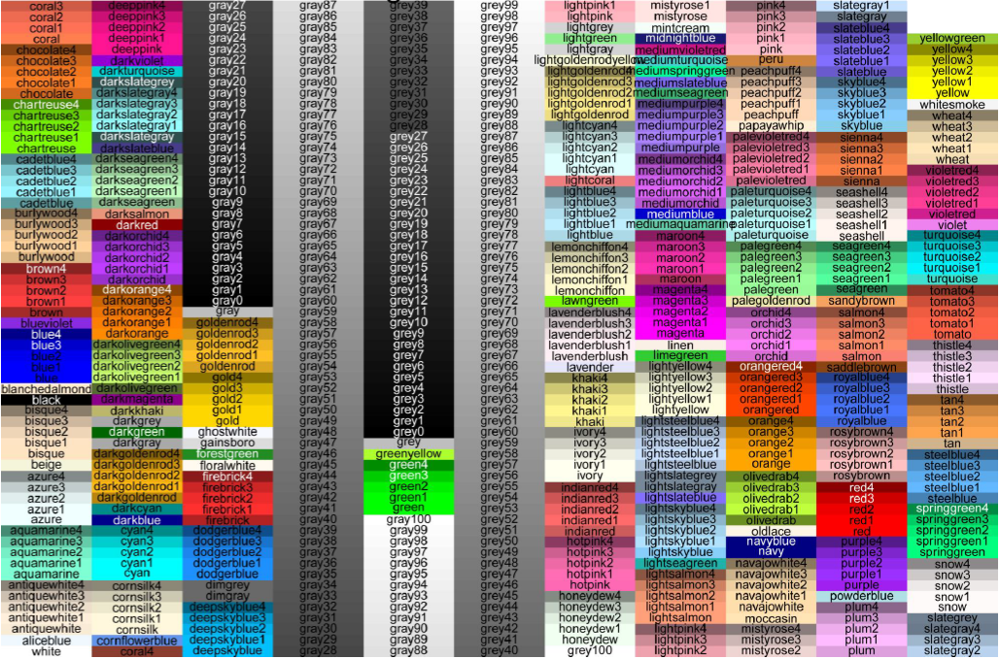
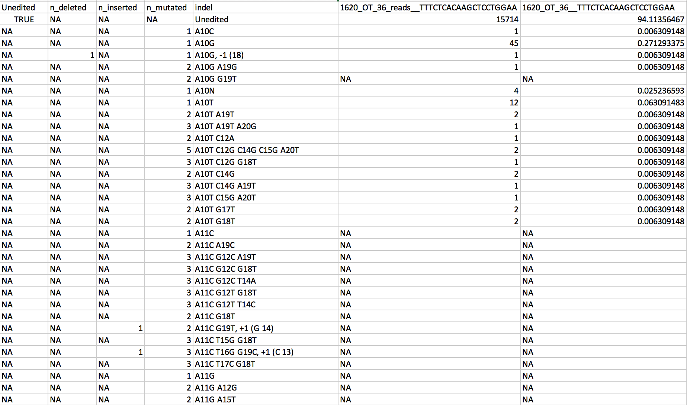
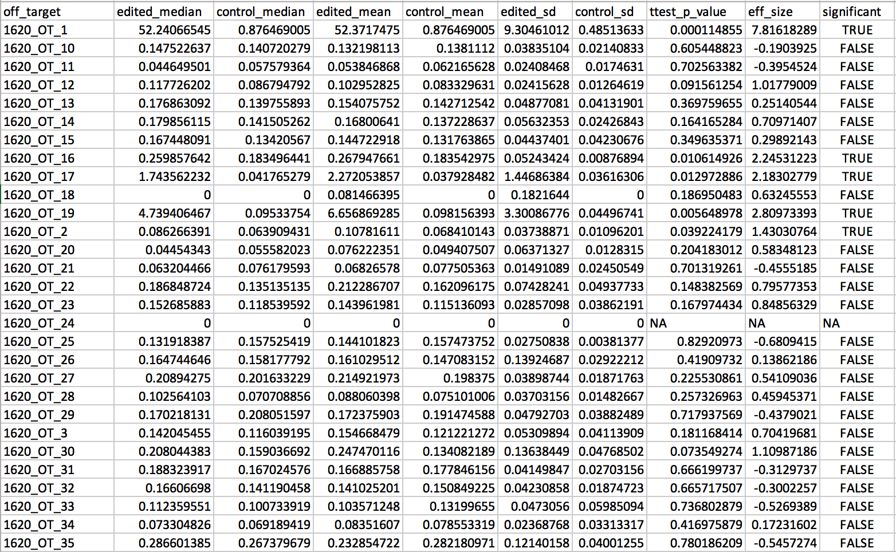
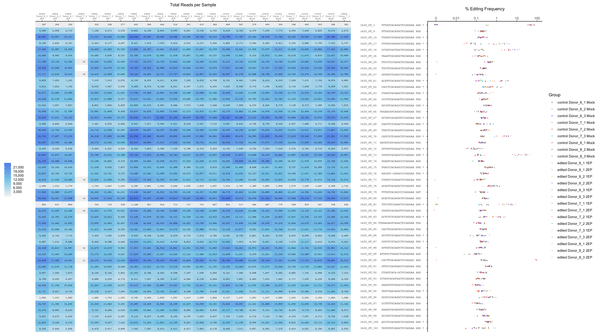

```{r setup, include=FALSE}
knitr::opts_chunk$set(echo = TRUE)
```
## Usage

This small suite of tools is compatible with CRISPResso v.2.0.37 and has the following modes:

* **collapse:**  summarize editing results and collapse reads by editing outcomes
* **BE:**   filter base editing results to exclude likely sequencing or amplification errors
* **OT:**   visualize potential off-target editing based on CRISPRessoPooled outputs


***

## Setup 

Download *CRISPResso2_downstream* source files from the CRISPResso2 Github repository.

The necessary package dependencies are best installed in a [conda](https://docs.conda.io/projects/conda/en/latest/user-guide/install/) environment.

Use the *crispresso_downstream_env.yml* file to generate a *crispresso_downstream_env* environment:  

```{r, eval = FALSE}
conda env create -f crispresso_downstream_env.yml
```

The environment contains the following dependencies:  
```{r, eval=FALSE}
python=2.7.15  
R>=3.5.1  

r-optparse  
r-tidyselect  
r-tidyverse  
r-RColorBrewer  
r-grid  
r-gtable  
r-extrafont  
r-scales  
r-effsize  
r-cowplot
```

Once the conda environment is generated, activate it with the following command:
```{r, eval = FALSE}
conda activate crispresso_downstream_env
```

To deactivate the conda enviroment after running the analyses, input the following:
```{r, eval = FALSE}
conda deactivate crispresso_downstream_env
```


All commands must be input from within the *CRISPResso2_downstream* source directory.

***

## Parameter list
  
##### Also available by running *Rscript CRISPResso2_downstream_v2.0.37.R -h*  
  
*-c, --crisp_out_dir*: path to folder storing CRISPRessoPooled output directories  
  
*-d, --dataID*: data identifier common to all names of CRISPRessoPooled input amplicons (regular expressions accepted)  
  
*-m, --mode*: analysis modes [default collapse_only]:  
  
* *collapse_only* = generate collapsed allele table only 
* *collapse_BE* = generate collapsed allele table & base editing summary (requires BE parameters)  
* *collapse_OT* = generate collapsed allele table & off-target summary (requires OT parameters)  
* *collapse_BE_OT* = generate collapsed allele table, base editing summary, and off-target summary (requires BE and OT parameters)  
* *BE_OT* = generates base editing and off-target summary (requires BE parameters, OT parameters, and collapsed allele tables)  
* *BE_only* = generates base editing summary (requires BE parameters and collapsed allele tables)  
* *OT_only* = generates off-target summary (requires OT parameters and collapsed allele tables)  

*-p, --percent_freq_cutoff*: minimum frequency an allele must appear in any sample/amplicon to be included in the collapsed output table  
[default 0]  
  
*--CRISPRessoBatch*: for any collapse mode: Use CRISPRessoBatch files as inputs [default FALSE]  
  
*--CRISPRessoPooled*: for any collapse mode: Use CRISPRessoPooled files as inputs [default FALSE] 
  
*-n, --noSub*:  do not include substitutions as edits in output table [default FALSE]  
  
*-f, --conversion_nuc_from*:  for any BE mode: the nucleotide targeted by the base editor [default C]  
  
*-t, --conversion_nuc_to*: for any BE mode: the nucleotide(s) produced by the base editor. If multiple nucleotides, enter all letters without separators (ex. ATCG) [default T] 
  
*-s, --ot_sample_csv*: for any OT mode: path to sample csv file (see "Input files" below for details)  
  
*-r, --ref_seq_csv*: for any OT mode: path to reference and guide sequences csv file (see "Input files" below for details)   
  
*-b, --be_summary_exists*: for OT_only mode: add this flag if BE summaries already exist AND set [-f, -t] if not default values) [default FALSE]
     
  \    

***

## Guidelines for CRISPResso inputs  
  
Follow the [CRISPResso2 documentation](https://github.com/pinellolab/CRISPResso2) to run either CRISPRessoBatch or CRISPRessoPooled.

### Using with CRISPRessoPooled

1. When running CRISPRessoPooled and multiple guides are used for the same amplicon, the full names of all guides must be included and separated by underscores in pooled.txt (ex. when guides/targets 1620_OT_10 and 1620_OT_14 are on the same amplicon, name the run "1620_OT_10_1620_OT_14").  

2. For easy identification and sorting, it is best to name off-targets *guide_OT_####* (ex. 1620_OT_12) beginning with the on-target as "0" (ex. 1620_OT_000).  

3. Set *--min_reads_to_use_region* lower if low read coverage is expected for any amplicon as amplicons with fewer reads aligned will not be included in the analysis.

 
***   
 
## Input files  
    
All input files (ref_seqs_csv and ot_sample_csv) should be in the same directory as the CRISPRessoBatch/CRISPRessoPooled run output files.
  \    
  
##### Off-target sample csv (*ot_sample_csv*)  
File linking CRISPRessoPooled output files to biological samples/conditions necessary for off-target analysis (not necessary for *collapse* or *BE* modes). As the off-target visualization tool takes up to **30 samples**, this table may have up to 30 rows (not including headers). 
  
```{r, eval = TRUE, echo=FALSE}
ot_sample_example <- data.frame( donor = rep(c("Donor1_1", "Donor1_2", "Donor2_1", "Donor2_2"), each = 2),
            condition = rep(c("mock", "edited"), times = 4),
            CRISPResso_dir_name = c("20200624_DB0024_S1", "20200624_DB0024_S2", "20200624_DB0024_S3", 
                                    "20200624_DB0024_S4", "20200624_DB0024_S5", "20200624_DB0024_S6",
                                    "20200624_DB0024_S7", "20200624_DB0024_S8"),
            sample_name = c("Donor1_1 mock", "Donor1_1 edit", "Donor1_2 mock", "Donor1_2 edit", 
                            "Donor2_1 mock", "Donor2_1 edit", "Donor2_2 mock", "Donor2_2 edit"),
            R_color = rep(c("red", "blue", "orange", "green"), each = 2),
            R_fill = rep(c("red", "blue", "orange", "green"), each = 2),
            R_shape = rep(c(1, 16), times = 4))

knitr::kable(ot_sample_example)
```

**Necessary columns:**  
  
1. *donor* = cell donor ID + technical replicate (if applicable) 
  
2. *condition* =  either "mock" or "edited"
  
3. *CRISPResso_dir_name* = names of CRISPRessoPooled output directories following *CRISPRessoPooled_on_*   
  
4. *sample_name* = sample names to be displayed in off-target output figure (*must include donor names exactly*)    
     
**Optional aesthetics columns (see options below):**  
  
5. *R_color* = R grDevices::colors color names or hex codes indicating the colors differentiating CRISPRessoPooled runs/samples in the off-target editing dotplot. If the column does not exist, default colors are generated.  
  
6. *R_fill* = R grDevices::colors color names or hex codes, same as R_color options. By default, R_fill options are the same as R_color options. 
  
7. *R_shape* = R ggplot2 shape options. By default, control/mock samples are unfilled circles (16), and edited samples are filled circles (1).  
     
  \    
 
##### R color and shape values {.tabset}

###### R_color
```{r, echo=FALSE, fig.cap="", out.width = '80%', fig.align="center"}

```
  
  \ 
  \  
 
###### R_shape
```{r, echo=FALSE, fig.cap="", out.width = '25%', fig.align="center"}
knitr::include_graphics("html_images/ggplot2_shapes.png")

```

    
  \  
  \ 
  
##### Off-target reference sequences csv (*ref_seq_csv*)
File containing the reference amplicon sequence, guide sequence, and PAM sequence for each off-target. The table is very similar to the CRIPSRessoPooled pooled.txt file and is necessary for off-target analysis (not necessary for *collapse* or *BE* modes).  
  
```{r, eval = TRUE, echo=FALSE}

ref_seq_example <- data.frame(ot_id = c("1620_OT_0", "1620_OT_1", "1620_OT_2", "1620_OT_3", "1620_OT_4",
                                        "1620_OT_5"),
                              amplicon_sequence = c("CTACAAAATTCAAATGC...", "GAAGATAAAATGTCTGGGC...", "TCTGTCTCTCGCTTTGAA...",	"GTATTTGGATTCTCAGCTCA...", "TCCTTTCAAGCAATGGTCAG...", "TCCTTTCAAGCAATGGTCAG..."),	
                              aligned_guide_seq = c("AGCATCCAGGCCCCAGGAA", "CTGGTCTCAGACTCCAGGAA", "ACAGTCACAGGCTCCAGGAT", "TTTATCACAGCCCCAGGAAA", "ACACTCACAGGCTCCAGAAA", "CTGGCTCACAGGCTCCAGAAA"),
                              guide_sequence = c("AGCATC-CAGGCCCCAGGAA", "CTGGTCTCAGACTCCAGGAA", "ACAGTCACAGGCTCCAGGAT", "TTTATCACAGCCCCAGGAAA", "ACACTCACAGGCTCCAGAAA", "CTGGCTCACAGGCTCCAGAAA"),
                              pam = c("TGG", "TGG", "AAG", "GGT", "GGG", "AGG"))

knitr::kable(ref_seq_example)

```

**Input columns:**  
Each off-target "guide" should be in a separate row regardless of whether they are on the same amplicon. With the exception of ot_id and guide_sequence, all sequences must be uppercase ATCG.
  
1. *ot_id* = off-target names (should match the names in the CRISPRessoPooled pooled.txt file *exactly*)
  
2. *amplicon_sequence* = from the CRISPRessoPooled pooled.txt file
  
3. *aligned_guide_seq* = 20-bp guide sequence in the CRISPRessoPooled pooled.txt file (no bulge placeholders "-" or lowercase letters)
 
4. *guide_sequence* = guide sequence to be displayed in off-target output figures (can contain bulge "-" placeholders and lowercase letters). *The sequences in this column must be unique.*
  
5. *pam* = PAM sequence to be displayed in off-target output figures (do not need to be cannonical PAMs)
  
***

## Summarize and collapse editing results (Collapse mode)
The Collapse mode uses the *Alleles_frequency_table_around_sgRNA_[guideseq].txt* output by CRISPResso to summarize each indel in more readable terms (deletion lengths and locations, insertion sequences and locations, substitution conversions and locations) with the first nucleotide of the guide as base pair index 1. Only modifications within the set quantification window are counted. 

Example *Alleles_frequency_table_around_sgRNA_[guideseq].txt*  

```{r, echo=FALSE, fig.cap="", out.width = '100%', fig.align="center"}

```


Unlike in the CRISPResso allele tables, each row is an unique indel, not a unique read. The Collapse mode collapses all reads with the same indel. Each indel must appear at or greater than the *percent_freq_cutoff* set by the user in *at least* one sample, or it is filtered out of the table before all allele frequencies are renormalized to 100%.  
  \  
  
#### **Example**  

*collapse_only mode* 
```{r eval = FALSE, echo = TRUE}
Rscript crispresso_downstream_v2.0.37.R -c /Users/local_Jing_BE/1620/20200711_1620_ONESeq_rhAMPSeq_triplicates -d OT -m collapse_only -p 0 --CRISPRessoPooled
```
  \  
  
#### **Output**

***[CRISPResso_RUN_NAME]\_collapsed_[percent_freq_cutoff].csv***  
Table of all collapsed indels across all samples in the CRISPRessoBatch or CRISPRessoPooled run generated from *Alleles_frequency_table_around_sgRNA_[guideseq].txt* (CRISPResso output).  

```{r, echo=FALSE, fig.cap="", out.width = '100%', fig.align="center"}

```
  \  
  
Columns:  

* *Aligned_Sequence* = example Aligned_Sequence around the quantification window center for one sample (kept as an artifact of CRISPResso output)
  
* *Reference_Sequence* = example Reference_Sequence around the quantification window center for one sample (kept as an artifact of CRISPResso output)
  
* *Unedited* = logical indicating whether the row contains the frequency of unedited alleles

* *n_deleted* = number of base pairs deleted in deletions overlapping the quantification window
 
* *n_inserted* = number of base pairs inserted in insertions overlapping the quantification window
  
* *n_mutated* = number of base pairs modified in substitutions overlapping the quantification window
  
* *indel* = detailed indel (sorted alphanumerically)
  
* *[run]_reads__[GUIDE_SEQ]* = number of reads of the indel (row) within the sample/CRISPResso run (column)

* *[run]__[GUIDE_SEQ]* = percent frequency of the indel (row) within the sample/CRISPResso run (column)

  \  
  \ 
    
## Filter base editing results (BE mode)  

The BE mode filters the collapsed allele tables by indel to only account for base editing (target and resulting nucleotides set by *-f* and  *-t* parameters) in the first 3-10 bps the guide and for indels in overlapping the  17-18 bps, the Cas9 cut site. All other edits are counted as "Unedited" in the output table.
 
  \  
  
#### **Example** 

*collapse_BE mode*  
```{r eval = FALSE, echo = TRUE}
Rscript 20200610_comLine_tester.R -c /Users/local_Jing_BE/1620/20200619_1620_ONESeq_rhAMPSeq_triplicates -p 0 -d 1620 -m collapse_BE -f C -t T --CRISPRessoPooled
```

*BE_only mode*  
```{r eval = FALSE, echo = TRUE}
Rscript crispresso_downstream_v2.0.37.R -c /Users/local_Jing_BE/1620/20200619_CRISPRessoBatch_1620_OT_111 -p 0 -d Donor -m BE_only -f C -t ATG
```


  \  
  
#### **Output**

***[CRISPResso_RUN_NAME]\_BE_summary\_[conversion].csv***  
Filtered allele table. The columns are the same as those of the collapsed allele tables (listed above.)  

```{r, echo=FALSE, fig.cap="", out.width = '100%', fig.align="center"}

```

  \  
  \ 
  
## Visualize potential off-target editing (OT mode)

*OT mode is generated for the purpose of visualizing off-target editing, but it can be re-purposed for any pool of amplicons ran in CRISPRessoPooled.*  

The OT mode performs simple t-test comparing percent editing in edited v. control samples and generates composite figures summarizing off-target editing. 
 
  \  
  
#### **Example** 

*collapse_BE_OT mode*  
```{r eval = FALSE, echo = TRUE}
Rscript crispresso_downstream_v2.0.37.R -c /Users/local_Jing_BE/1620/20200619_1620_ONESeq_rhAMPSeq_triplicates -p 0 -d 1620 -m collapse_BE_OT -f C -t ATCG -s 20200619_1620_rhAMPSeq_samples.csv -r 1620_ONESeq_ref_seqs.csv --CRISPRessoPooled
```
*collapse_OT mode*  
```{r eval = FALSE, echo = TRUE}
Rscript crispresso_downstream_v2.0.37.R -c /Users/IND_off_target/2020_CRISPResso2/20200710_DE_1450_rhAMPSeq -d OT -m collapse_OT -p 0 -n -s 202006_DE_1450_rhAMPSeq_samples.csv -r 202006_1450_0000_ref_seqs.csv --CRISPRessoPooled
```
*OT_only mode (BE summary exists)* 
```{r eval = FALSE, echo = TRUE}
Rscript crispresso_downstream_v2.0.37.R -c /Users/local_Jing_BE/1620/20200326_1620_ONESeq_rhAMPSeq_CRISPRessoPooled -p 0 -d 1620 -m OT_only -f C -t T -s ../BE_rhAMPSeq_samples.csv -r ../1620_ONESeq_ref_seqs.csv --CRISPRessoPooled -b

```
*OT_only mode*  
```{r eval = FALSE, echo = TRUE}
Rscript crispresso_downstream_v2.0.37.R -c /Users/IND_off_target/2020_CRISPResso2/20200710_DE_1450_rhAMPSeq -d OT -m OT_only -p 0 -n -s 202006_DE_1450_rhAMPSeq_samples.csv -r 202006_1450_0000_ref_seqs.csv --CRISPRessoPooled
```

  \  
  
#### **Output**

***YYYYMMDD_CRISPResso_OT_editing_summary.csv***  
A table displaying the total editing frequency per off-target, per sample.  

```{r, echo=FALSE, fig.cap="", out.width = '100%', fig.align="center"}

```
  \ 
  
Columns:  

* *off_target	* = off-target names
  
* *guide_sequence* = guide/off-target sequence (no PAM) including mismatches and bulges
  
* *pam* = PAM sequence

* *sample* = sample name
 
* *condition* = control or edited 
  
* *aligned_guide_seq* = guide/off-target sequence without mismatches/bulges (the sequence used for alignment)
  
* *editing_freq* = total editing frequncy per off-target, per sample 
  
* *reads* = number of edited reads

* *group* = editing condition + sample name (same as in off-target composite figure below)

  \  
  
***YYYYMMDD_CRISPResso_OTs_ttest.csv***  
This table displays summary statistics as well as the results of simple statistical tests comparing edited v. mock samples by off-target. Editing frequency (%) is pooled by off-target for all mock samples and all edited samples, and an independent, one-tailed t-test (95% confidence interval, Welch df) is performed to determine whether editing frequency is higher in edited samples compared to mock samples for each off-target. If fewer than 3 samples are included for either the edited or mock group, no statistical test is performed for the off-target. Likewise, if the variance is equal, no test is performed. In both cases, the p-value is NA in the output table.

In conjunction with the t.test, Cohen's d (effect size) is also calculated using a 95% confidence interval (not pooled, Hedges correction applied).  

```{r, echo=FALSE, fig.cap="", out.width = '100%', fig.align="center"}

```
  \ 
  
Columns:  

* *off_target	* = off-target names
  
* *edited/control_median* = median value of edited/control editing frequencies (%) by off-target
  
* *edited/control_mean* = mean value of edited/control editing frequencies (%) by off-target

* *edited/control_sd* = standard deviation of edited/control editing frequencies (%) by off-target
 
* *ttest_p_value* = independent, one-tailed t-test (95% confidence interval, Welch df) p-value comparing edited v. mock samples
  
* *eff_size* = Cohen's d (effect size) of difference between edited v. mock editing frequencies
  
* *significant* = logical indicating whether the editing was significant for the off-target (for easy filtering)  

  \  
  
***off_target_Rplot.png/pdf***  
Example figure below. The heatmap on the left displays the read coverage per amplicon, per sample. The off-target names and sequences in the center are followed by an **\*** when the editing frequency in edited samples is significantly higher than that in mock/control samples. The editing frequency is displayed in the dotplot on the right.  
  \ 
  
```{r, echo=FALSE, fig.cap="", out.width = '100%', fig.align="center"}

```
  \ 
 
